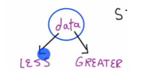
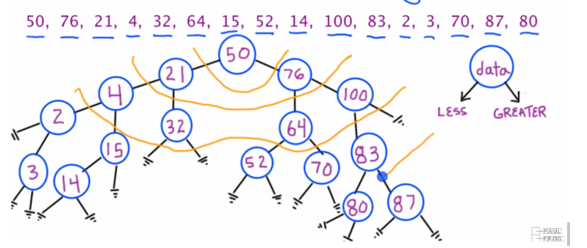
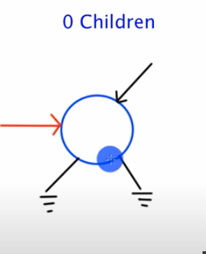
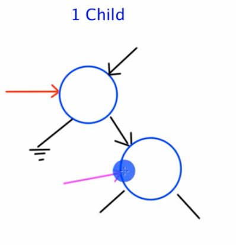
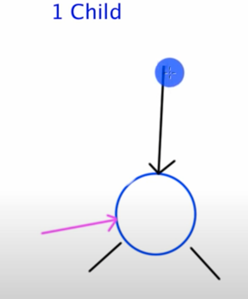
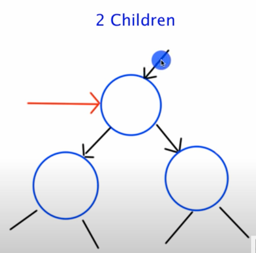
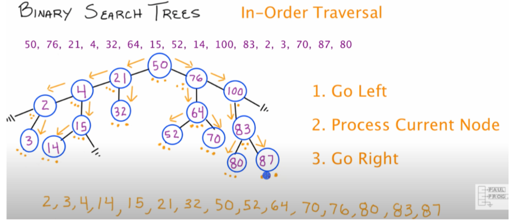

# Trees Notes

## Introduction to Binary Search trees 
from https://www.youtube.com/watch?v=sf_9w653xdE




- value of node attached to left pointer is less than the value of the node attached to right pointer 


<br />


- **root**: node at top (50)
- 50 is the **parent** of 21 and 76, 76 and 21 are the **children** of 50
- **leaf**: node that does not connect to any other nodes by their left and right pointers. connected to the tree by it's parent pointer, but it doesn't point to any node itself. <u>does not have any cnildren </u>(bottom nodes in picture)
- leafs should have null terminanting statements (Drawn in picture)

## Deleting Nodes 
<u>Has 3 possiblies: 0 children, 1 child, and 2 children</u>
<br />
### 0 children

- Red arrow is just to indicate what node to delete 
- Delete the node and make sure the pointer pointing to that node(top black arrow) is pointing to null 
  <br />

### 1 child
 
- Red arrow is just to indicate what node to delete
- Create a pointer to point to the child node (pink arrow) so you can reattach it to the tree.
- Delete the node
  
- Instruct the pointer that was pointing to the pointer you just deleted to point to the child node
- By doing this you reconnect the tree and reattain its properties
<br />
### 2 children

- **Find the smallest key in the node's right sub-tree**
- Take the information from that node and overwrite the information in the node you want to delete
- By doing that, that key is now greater than all of the trees of the left sub-tree and it's less than all of the keys in the right sub-tree 
- Delete node that had the smallest key in the node's right subtree

## In Order Transversal

1. Go Left
2. Process Current Node
3. Go Right
- Prints lowest to highest key
- Start at root 
- Uses Recursion fall back to previous node

## Coding Project Setup 
- to compile and run the code: do g++ main.cpp, then ./a.out
### main.cpp
<details>

<summary>main.cpp setupcode</summary>

```C++
#include <iostream>
#include <cstdlib>
#include "BST.cpp"

using namespace std;

int main()
{

    return 0;
}
```
</details>

<br >


### BST.h
- interface for BST class
<details>

<summary>BST.h setup code</summary>

```C++
class BST
{
// basic building block of BST
private: 
struct node
{
int key;
node *left;
node *right;
};
node *root; // root pointer to reference top of tree/root node

public: 
BST(); 
node *CreateLeaf(int k); 
};
```
</details>

<br>


BST.cpp
- implement addLeaf and addLeafPrivate functions
<details>

<summary>BST.cpp setup code</summary>

```C++
#include <iostream>
#include <cstdlib>
#include "BST.h"

using namespace std;

BST::BST()
{
    root = NULL;

}
 
// put BST twice because return type node* is defined from BST class 

BST::node* BST::createLeaf(int k)
{
    node *n=new node;
    n->key=k;
    n->left=NULL;
    n->right=NULL;
    return n; 
}
```
</details>

<br>

## Add Node Function
BST.h 
- create addLeaf function
- create addLeafPrivate function
<details>

<summary>BST.h code</summary>

```C++
class BST
{
// basic building block of BST
private: 
struct node
{
int key;
node *left;
node *right;
};
node *root; // root pointer to reference top of tree/root node
void addLeafPrivate(int k, node* ptr);

public: 
BST(); 

node *createLeaf(int k); 

void addLeaf(int k); 
};
``` 

</details>


<br />


BST.cpp
- implement addLeaf function
- implement addLeafPrivate function

<details>

<summary>BST.cpp code</summary>

```C++
#include <iostream>
#include <cstdlib>
#include "BST.h"

using namespace std;

BST::BST()
{
    root = NULL;

}
 
// put BST twice because return type node* is defined from BST class 

BST::node* BST::createLeaf(int k)
{
    node *n=new node;
    n->key=k;
    n->left=NULL;
    n->right=NULL;
    return n;
}

// all you want it to do is call addLeafPrivate function
// need this for when calling from main
// starts at root 
void BST::addLeaf(int k)
{
    addLeafPrivate(k,root);
}

void BST::addLeafPrivate(int k,node *ptr)
{
// if root is not pointing to anything (tree is empty)
    if(root==NULL)
    {
    // let root point to a newly created leaf
    root = createLeaf(k);
    }
    // if new key is less than current node key 
    else if(k < ptr->key)
    {
        // if the left pointer is pointing to something
        if(ptr->left !=NULL)
        {
            // traverse down left 
            // recursively call add leaf function
            addLeafPrivate(k,ptr->left);
        }
        else 
        // left pointer is NOT pointing to something
        {
            // add new node
            ptr -> left=createLeaf(k);
        }
    }

    else if(k > ptr->key)
    {
        // if the left pointer is pointing to something
        if(ptr->right !=NULL)
        {
            addLeafPrivate(k,ptr->right);
        }
        else 
        // right pointer is NOT pointing to something
        {
            // add new node
            ptr -> right=createLeaf(k);
        }
    }
    // new key is equal to current key
    else 
    {
        cout << "The key " << k << "has already been added to the tree" << endl;
    }
}
```
</details>
<br>

## Print in Order Function
Goes in BST.h file 
```C++
private:
void printInOrderPrivate(node *ptr);
public: 
void printInOrder();
```
Goes in BST.cpp file
```C++
void BST::printInOrder()
{
// start traversal at the root
printInOrderPrivate(root);
}

void BST::printInOrderPrivate(node *ptr)
{
// if there is something in the tree 
if(root!=NULL)
{
    // if left pointer is pointing to something
    if(ptr->left !=NULL)
    {
        // recursive call
        // Step One: go left 
        printInOrderPrivate(ptr->left);
    }
    // print contents of current node
    // Step Two: Process current node
    cout << ptr->key << " " << endl;
    // Step Three: Go right if possible
    if(ptr->right !=NULL)
    {
        // recursively call 
        printinOrderPrivate(ptr->right);
    }
}
else
cout << "The tree is empty" << endl; 
}
```
Goes in main.cpp
```C++
 // numbers from in markdown file picture
    int treeKeys[16] = {50,76,21,4,32,64,15,52,14,100,83,2,3,70,87,80};

    // create BST object
    BST myTree;
  
    cout << "Printing the tree in order\nBefore adding Numbers\n";

    myTree.printInOrder();
    for(int i=0;i<16;i++)
    {
      // adding all of the numbers
      myTree.addLeaf(treeKeys[i]);
    }
    cout << "Printing the tree in order\nAfter adding numbers\n";
    myTree.printInOrder();

```

## Return Node Function
- Return a node pointer to a node that corresponds to a key value you are passing in 
  
### BST.h
```C++
private: 
node* returnNodePrivate(int k,node *ptr);
public:
node* returnNode(int k);
```
### BST.cpp
```C++
BST::node* BST::returnNode(int k)
{
    // call return node private function
    return returnNodePrivate(k,root);
}
BST::node* BST::returnNodePrivate(int k,node *ptr)
{
    // check to see if pointer passed in is pointing to anything
    if(ptr !=NULL)
    {
        // see if current key is equal to key passed in 
        if(ptr->key == k)
        {
            // return pointer that is pointing to current node
            return ptr;
        }
        // not pointing to the right node
        else
        {
            // if key value passed in is less than key value you are looking at 
            if(k < ptr->key)
            {
                // use recursion to find it
                // Go left 
                return returnNodePrivate(key,ptr->left);
            }
            // greater than 
            else 
            {
                return returnNodePrivate(key,ptr->right);
            }
        }
    }
    else
    throw nullptr;
   // return NULL; can't return null
}

```

## Print Children Function

### BST.h
```C++
public: 
int returnRootKey();
void printChildren(int k);
```
### BST.cpp
```C++
int BST::returnRootKey()
{
    if(root!=NULL)
    {
        return root->key;
    }
    else
    throw nullptr;
   // return NULL; 
}

void BST::printChildren(int k)
{
    // create node pointer
    node *ptr=returnNode(k);
    if(ptr!=NULL)
    {
        cout << "Parent Node = " << ptr->key << endl;

        // conditional operator
        // if true, executes code 1
        // if false, executes code 2
        ptr->left==NULL?
        cout << "Left Child = NULL\n" : // code 1 , notice the : not ; 
        cout<< "Left Child = " << ptr->left->key << endl;  // code 2

         ptr->right==NULL?
        cout << "Right Child = NULL\n" : // code 1 , notice the : not ; 
        cout<< "Right Child = " << ptr->right->key << endl;  // code 2

    }
    else
    {
        cout << "Key " << k << "is not in the tree\n";
    }

}

```

### main.cpp
```
myTree.printChildren(myTree.returnRootKey());

```

## Find Smallest Key Function
helper function in order to remove a node with 2 children
- find smallest key in node's right sub-tree
### BST.h
```C++
private:
// recursively move through the tree
int findSmallestPrivate(node *ptr);
public: 
int findSmallest();
```
### BST.cpp
```C++
int BST::findSmallestPrivate(node *ptr)
{
    if(root==NULL)
    {
        cout << "The tree is empty\n";
        throw nullptr;
    }
    else
    {
        // if left ptr is pointing to a node, recursively traverse down
        if(ptr->left!=NULL)
        {
        return findSmallestPrivate(ptr->left);
        }
        else
        {
            return ptr->key;
        }
    }
    
}
// call this in main
int BST::findSmallest()
{
    findSmallestPrivate(root);
}
```
### main.cpp 
```C++
cout << "The smallest value in the tree is " << myTree.findSmallest() << endl;
```

## Remove Node Function

### BST.h
```C++
private:
void removeNodePrivate(int k,node *parent);
public: 
// starts recursive process by calling a remove node private function
void removeNode(int k);
```
### BST.cpp
```C++
void BST::removeNodePrivate(int k,node *parent)
{
    if(root!=NULL)
    {
        if(root->key==key)
        cout <<"Root found. Write a function to remove." << endl;
       // removeRootMatch(); // function not written yet
       else
       {
        // look at left child
        // if key want to remove has a value less than current nodes key
        if(k<parent->key && parent->left !=NULL)
        {
            // if parent's left child contains 
            // key value equal to key we're trying to delete
            parent->left->key==k?
            //removeMatch(parent,parent->left,true): function not written yet
            removeNodePrivate(k, parent->left); // left node becomes parent node in the next recursive iteration
        }
        else if (k>parent->key && parent->right !=NULL)
        {
            parent->right->key==k?
            //removeMatch(parent,parent->right,false): function not written yet // false bc right child 
            // recursively mode down right pointer
            removeNodePrivate(k, parent->right);
        }
        else 
        {
            cout << "The key " << k << " was not found in the tree\n";
        }
       }
    }
    else
    {
        cout << "The tree is empty\n";
    }
}

void BST::removeNode(int k)
{
    // start at the root 
    removeNodePrivate(k,root);
}
```
